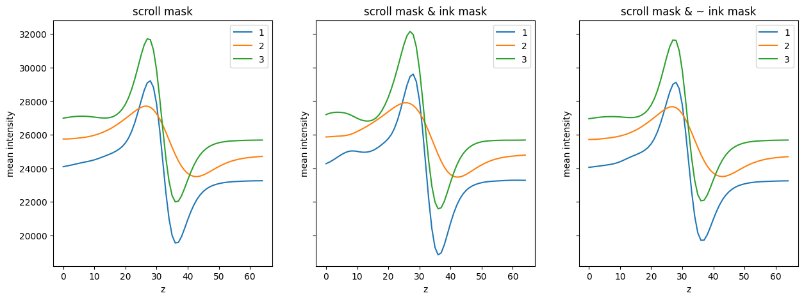
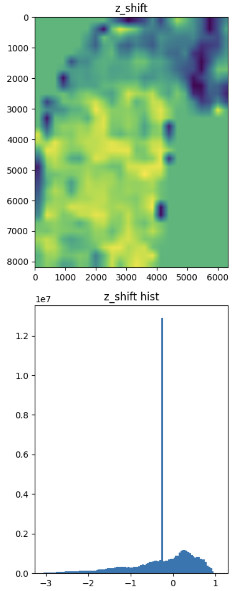
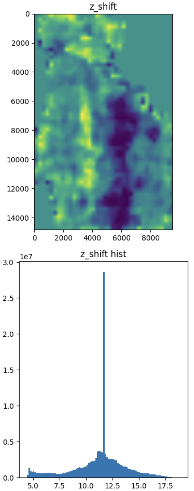
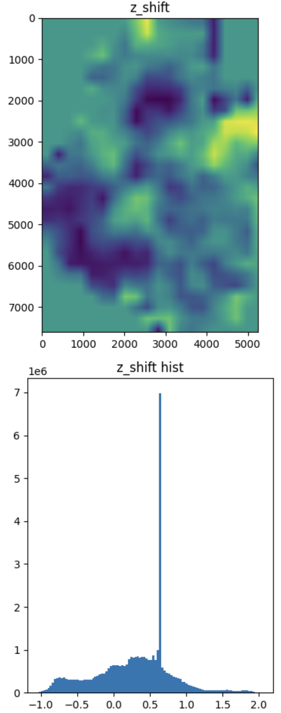

# Introduction

This repository contains deep learning development environment for 13th place in [Vesuvius Challenge - Ink Detection](https://www.kaggle.com/competitions/vesuvius-challenge-ink-detection/overview) competition.

# To reproduce

The solution is working in Docker VSCode devcontainer. Requirements are: 
- Docker
- VSCode
- ~
80 Gb of free disk space 
- 64 Gb RAM available 
- (optional) [wandb](https://wandb.ai/) account
- (optional but highly recommended for fast training / inference) decent 16 GB GPU

To reproduce top 13 solution, please follow the steps below:

## Training

1. Clone the repository: `git clone --recurse-submodules https://github.com/mkotyushev/scrolls.git` & checkout to `622e3da5d3c4023db27bb071f463b8c27f87dcfb` commit
2. Run the container: open the cloned `scrolls` dir in VSCode and click `Reopen in Container`
3. Prepare the data 
- download dataset to `/workspace/data/fragments` (e. g. path to sample submission is `/workspace/data/fragments/sample_submission.csv`)
- run `/workspace/scrolls/generate_maps.ipynb` notebook to pre-process data: `/workspace/data/fragments_z_shift_scale` dir will be produced
- move the data: `mv /workspace/data/fragments_z_shift_scale /workspace/data/fragments_z_shift_scale/fragments_z_shift_scale_3_stage_256_2`
4. Activate the environment: `conda activate scrolls`
5. (Optional) disable wandb by issuing `wandb disabled` command inside `/workspace/scrolls` dir if you do not want to use wandb
6. Following command with `VAL_DIR_INDEX` from 0 to 4 inclusively will produce 5 models in `/workspace/scrolls/scrolls` dir named by wandb run IDs (8 alphanumeric characters):
```
python run/main.py fit --config run/configs/2d-agg/unet-2d-agg.yaml --config run/configs/2d/maxvit.yaml --data.init_args.val_dir_indices VAL_DIR_INDEX
```

Inside each produced dir `X` inside `/workspace/scrolls/scrolls` there will be `checkpoints/epoch=N-step=M.ckpt` file corresponding to the best checkpoint on validation fold by F05 metric.

## Inference

### Single model validation
Validation could be run by issuing following command:
```
python /kaggle/input/scrolls/run/main.py 
    validate \
    --config /kaggle/input/scrolls/run/configs/2d-agg/unet-2d-agg.yaml \
    --config /kaggle/input/scrolls/run/configs/2d/maxvit.yaml \
    --model.init_args.pretrained false \
    --model.init_args.tta_each_n_epochs -1 \
    --data.init_args.use_online_val_test false \
    --data.init_args.z_shift_scale_pathes_test null \
    --data.init_args.z_start 20 \
    --data.init_args.z_end 44 \
    --data.init_args.num_workers 2 \
    --data.init_args.surface_volume_dirs FRAGMENT_PATH \
    --data.init_args.val_dir_indices 0 \
    --data.init_args.surface_volume_dirs_test null \
    --ckpt_path CHECKPOINT_PATH
```

`FRAGMENT_PATH` is path to single pre-processed fragment root dir (e. g. `/workspace/data/fragments_z_shift_scale_3_stage_256_2/train/1`), `CHECKPOINT_PATH` is path to `/workspace/scrolls/scrolls/X/checkpoints/epoch=N-step=M.ckpt` file produced during training.

The validation results should be same (up to rounding) as in the table provided below in [Model](#model) section.

### Prediction

For prediction the command in following:
```
python /kaggle/input/scrolls/run/main.py 
    predict \
    --config /kaggle/input/scrolls/run/configs/2d-agg/unet-2d-agg.yaml \
    --config /kaggle/input/scrolls/run/configs/2d/maxvit.yaml \
    --model.init_args.pretrained false \
    --model.init_args.tta_each_n_epochs -1 \
    --data.init_args.use_online_val_test true \
    --data.init_args.z_shift_scale_pathes_test null \
    --data.init_args.z_start 20 \
    --data.init_args.z_end 44 \
    --data.init_args.num_workers 2 \
    --data.init_args.surface_volume_dirs null \
    --data.init_args.val_dir_indices null \
    --data.init_args.surface_volume_dirs_test FRAGMENT_PATH \
    --ckpt_path CHECKPOINT_PATH
```

This will produce single `Y_Z.png` (`Y` is fragment dir name, `Z` is random alphanumeric string) file and `submission.csv` in the current dir. 

To aggregate multiple models predictions use following command in the dir with `.png` files:

```
python /workspace/scrolls/src/scripts/aggregate_images.py . .
``` 

It will produce the final `submission.csv` of mean models predictions in the current directory.

`scrolls-inference-agg.ipynb` is used as inference notebook in Kaggle environment, [pyvips installer](https://www.kaggle.com/mkotyushev/pyvips-offline-installer) and [python packages](https://www.kaggle.com/datasets/mkotyushev/scrolls-software) are required as additional data sources.

**Note**: in Kaggle environment there is only 13 Gb of RAM, so `use_online_val_test` flag is set to `true` to avoid loading all the data into memory. This will result in slower inference and may produce slightly different results.

**Note**: no TTA is used during training / validation to get the results in [Model](#model) section, so `tta_each_n_epochs` is set to `-1` here. During inference on Kaggle TTA is used, so `tta_each_n_epochs` is set to `1` in Kaggle notebook.

# Solution


Data:
- Z shift and scale pre-processing based on mean layer intensity curve fitting to fragment 3's mean intensity curve (inspired by [this](https://www.kaggle.com/code/ajland/eda-a-slice-by-slice-analysis) notebook)
- 5 fold training (1, 2a, 2b, 2c, 3 fragments, 2nd fragment is split by scroll mask area: top part + 2 bottom parts)
- weighted sampling from fragments according to scroll mask area
- patch size is 384, on test overlap is 192 via spline-weighted averaging (inspired by [this](https://github.com/bnsreenu/python_for_microscopists/blob/master/229_smooth_predictions_by_blending_patches/smooth_tiled_predictions.py) approach)
- 24 slices with indices in [20, 44), random crop of 18 of them, each 3 slices window is fed to model and 6 resulting logits aggregated via linear layer

Training:
- model is SMP Unet with 2D pre-trained encoder + linear layer aggregation
- random crop inside scroll mask + standard vision augmentations
- BCE loss with 0.5 weight of positive examples, selection by F0.5 score on validation fold
- 64 epoch training, epoch length is ~ number of patches in train set (it is not constant because of random cropping)
- LR is 1e-4, no layers freezing / LR decay, schedule is cosine annealing with warmup (1e-1, 1, 1e-2 factors, 10% warmup), optimizer is AdamW

Inference:
- TTA: cartesian product of 4 rotations (0, 90, 180, 270) and 3 flips (no flip, horizontal, vertical) -> 12 predictions per volume (brought this idea from [here](https://www.kaggle.com/code/yoyobar/2-5d-segmentaion-model-with-rotate-tta))
- TTA probabilities are averaged, writen to image file, then 5 models images averaged

Environment & tools:
- docker, pytorch lightning CLI, wandb
- 1 x 3090, 1 x 3080Ti mobile

# Some details
## Data

Inspired by [this](https://www.kaggle.com/code/ajland/eda-a-slice-by-slice-analysis) analysis, I plot the mean intensity of each layer of each fragment for full image, only for ink and only for backgound.



Here it could be observed that fragments 1 and 3 are more or less similar in terms of both intencity values and minimum and maximum positions, while fragment 2 is different. 

My physical intuition behind this is following: papirus seems not being aligned by depth inside 3D volume, moreover papirus thinknes seems to vary between fragments 1, 3 and fragment 2. 

So, I've decided to align and stretch / compress papirus in z dimension by shift and scale operation:

1. Split the volume on overlapping patches in H and W dimentions
2. For each patch 
- calculate mean intensity of each layer
- fit `z_shift` parameter to minimize following loss (`y_target` here is the intensity curve of full fragment 3)
```
z_shifted = z + z_shift
f = interpolate.interp1d(z_shifted, y, bounds_error=False, fill_value='extrapolate')
return f(z_target) - y_target
```
3. For full volume fit single `z_scale` (assuming pairus thickness is same for same fragment) in a similar manner.
4. Linearly upsample resulting `z_shift` and `z_scale` maps to full volume size and save them on disk.
5. Apply `z_shift` and `z_scale` to full volume via `scipy.ndimage.geometric_transform` with transform writen as C module for speed.
6. For training save it on disk, for inference apply on the fly.

Resulting `z_shift` maps and `z_scale` values are following:

|Fragment 1|Fragment 2|Fragment 3|
| -------- | ------ | ---------- |
||||

Z scale is ~ 1.0 for fragments 1 and 3 and ~ 0.6 for fragment 2 which could indicate the fragment 2 being ~ twice thicker that others.

Such operation should be beneficial for 2D approaches. It seems to improve CV on ~0.03-0.05 F05, but I did not run full comparison due to time constraints.

Also, I've tried to fit / calculate normalization for each fragment separately to completely fit the intencity curve, but it did not work well.

## Model

Pre-trained maxvit encoder + SMP 2D unet with aggregation has shown the best CV score, so `maxvit_rmlp_base_rw_384.sw_in12k_ft_in1k` is the one used in best solution. 

2D unet with aggregation works as follows: unet model is applied on each slice of the input with size = step = 3 along z dimention (total 6 slices), then 6 resulting logits are aggregated via linear layer.

Usage of pre-trained models is yielding far better results that random initialization. Unfortunately I did not came up with better architecture allowing to handle 3D inputs and 2D outputs while allowing to use pre-trained models.

Best CV scores of ths model and corresponding predictions are following:

| Fragment | F05    | Prediction |
| -------- | ------ | ---------- |
|1         | 0.6544 ||
|2a        | 0.6643 ||
|2b        | 0.7489 ||
|2c        | 0.6583 ||
|3         | 0.7027 ||

**Tried, but did not work well**

Multiple backbone models:
- convnext v2
- swin transformer v2
- caformer
- eve02
- maxvit 

And multiple full model approaches: full 3D with aggregation on the last layer, 2.5D, 2D with aggregation, custom 3D models with pre-trained weights conversion from 2D to 3D.

## Transforms

Following augmentations are used for training
```
train_transform = A.Compose(
    [
        RandomCropVolumeInside2dMask(
            base_size=self.hparams.img_size, 
            base_depth=self.hparams.img_size_z,
            scale=(0.5, 2.0),
            ratio=(0.9, 1.1),
            scale_z=(1 / self.hparams.z_scale_limit, self.hparams.z_scale_limit),
            always_apply=True,
            crop_mask_index=0,
        ),
        A.Rotate(
            p=0.5, 
            limit=rotate_limit_degrees_xy, 
            crop_border=False,
        ),
        ResizeVolume(
            height=self.hparams.img_size, 
            width=self.hparams.img_size,
            depth=self.hparams.img_size_z,
            always_apply=True,
        ),
        A.HorizontalFlip(p=0.5),
        A.VerticalFlip(p=0.5),
        A.RandomRotate90(p=0.5),
        A.RandomBrightnessContrast(p=0.5, brightness_limit=0.1, contrast_limit=0.1),
        A.OneOf(
            [
                A.GaussNoise(var_limit=[10, 50]),
                A.GaussianBlur(),
                A.MotionBlur(),
            ], 
            p=0.4
        ),
        A.GridDistortion(num_steps=5, distort_limit=0.3, p=0.5),
        A.CoarseDropout(
            max_holes=1, 
            max_width=int(self.hparams.img_size * 0.3), 
            max_height=int(self.hparams.img_size * 0.3), 
            mask_fill_value=0, p=0.5
        ),
        A.Normalize(
            max_pixel_value=MAX_PIXEL_VALUE,
            mean=self.train_volume_mean,
            std=self.train_volume_std,
            always_apply=True,
        ),
        ToTensorV2(),
        ToCHWD(always_apply=True),
    ],
)
```

Here, `RandomCropVolumeInside2dMask` crops random 3D patch from volume so that its center's (x, y) are inside mask, `ResizeVolume` is trilinear 3D resize and `ToCHWD` simply permutes dimentions. `img_size` = 384, `img_size_z` = 18, `z_scale_limit` =  1.33, `rotate_limit_degrees_xy` = 45, `train_volume_mean` and `train_volume_std` are average of imagenet stats.

For inference, following transforms are used

```
test_transform = A.Compose(
    [
        CenterCropVolume(
            height=None, 
            width=None,
            depth=math.ceil(self.hparams.img_size_z * self.hparams.z_scale_limit),
            strict=True,
            always_apply=True,
            p=1.0,
        ),
        ResizeVolume(
            height=self.hparams.img_size, 
            width=self.hparams.img_size,
            depth=self.hparams.img_size_z,
            always_apply=True,
        ),
        A.Normalize(
            max_pixel_value=MAX_PIXEL_VALUE,
            mean=self.train_volume_mean,
            std=self.train_volume_std,
            always_apply=True,
        ),
        ToTensorV2(),
        ToCHWD(always_apply=True),
    ],
)
```

Here, `CenterCropVolume` is center crop of 3D volume.

Mixing approaches (cutmix, mixup, custom stuff like copy-paste the positive class voxels) also were tried but shown contradicting results, so were not included.

Cartesian product of `no flip / H flip / V flip` and `no 90 rotation / 90 rotation / 180 rotation / 270 rotation` is used for TTA yielding total 12 predictions.


# EVA02 installation

**Note**: EVA02 model is not used in actual solution, it is included for completeness so steps below in this section are optional.

### mmcv & mmsegmentation
1. mmcv: `pip install mmcv==2.0.0 -f https://download.openmmlab.com/mmcv/dist/cu117/torch2.0/index.html`
2. mmsegmentation & deps (except apex, which needs to be build from source): `pip install xformers==0.0.20 einops==0.6.1 mmsegmentation==1.0.0`
3. apex: `cd lib && git clone https://github.com/NVIDIA/apex && cd apex && CC='/usr/bin/gcc-9' CXX='/usr/bin/g++-9' pip install -v --disable-pip-version-check --no-cache-dir --global-option="--cpp_ext" --global-option="--cuda_ext" ./`
